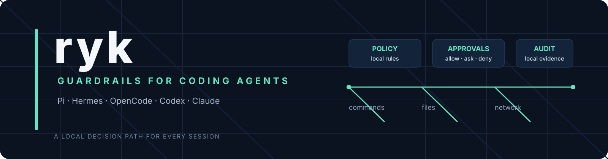
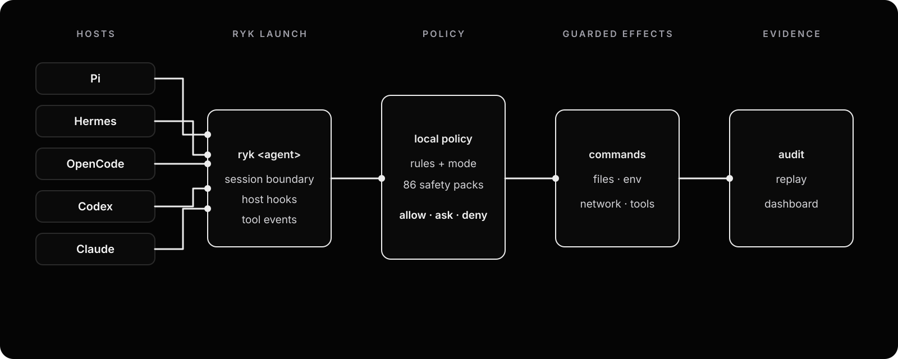

<p align="center">
  
</p>

<p align="center">
  <a href="https://rykanv.com/">Website</a> ·
  <a href="https://discord.gg/uZn9MDUYKx">Discord</a> ·
  <a href="CONTRIBUTING.md">Contributing</a> ·
  <a href="SECURITY.md">Security</a>
</p>

<p align="center">
  <a href="README.zh-CN.md">简体中文</a> ·
  <a href="README.ur-pk.md">اردو</a> ·
  <a href="README.es.md">Español</a>
</p>

<p align="center">
  <a href="https://github.com/christopherkarani/ryk/actions/workflows/build.yml"></a>
  <a href="https://github.com/christopherkarani/ryk/blob/main/LICENSE"></a>
  <a href="https://github.com/christopherkarani/ryk"></a>
</p>

# ryk

Run coding agents with guardrails.

ryk is a local control layer for the agents engineers already use. Launch Pi, Hermes, OpenCode, Codex, or Claude through `ryk <agent>`. The agent keeps its normal terminal and tool workflow while ryk evaluates commands, files, environment and secrets, network requests, MCP actions, and other effects against policy.

The result is a clear path from agent to action: allow, ask, deny, or observe. Sessions leave a local audit trail that you can inspect with `ryk dashboard` or `ryk replay`.

If you run coding agents in real repositories, [star the project](https://github.com/christopherkarani/ryk). It helps other engineers find the project and gives us a useful signal on which host integrations to prioritize.

## What you get

| | |
| --- | --- |
| `ryk <agent>` | One guarded launch path for Pi, Hermes, OpenCode, Codex, Claude, OpenClaw, and Grok. |
| 86 built-in safety packs | Command patterns for common destructive and sensitive operations, with focused packs you can enable per project. |
| `allow`, `ask`, `deny`, `observe` | Policy decisions that are visible to the host and recorded for review. |
| Local dashboard and replay | Inspect sessions, policy decisions, and evidence without sending the session to a hosted service. |
| Zig CLI | A single local binary for launch, evaluation, policy checks, host adapters, and diagnostics. |

## Install

```sh
curl -fsSL https://rykanv.com/install | sh
```

The installer prints the shell activation line for your platform. Once `ryk` is on your `PATH`, launch an agent through `ryk <agent>`.

## Start an agent

Use the host name after `ryk`:

```sh
ryk pi
```

The same guarded launch path is available for the other main hosts:

```sh
ryk hermes
ryk opencode
ryk codex
ryk claude
```

Check the local posture when you need it:

```sh
ryk doctor
```

The aliases set agent-primary defaults for network mediation, OS route enforcement, and the secret boundary. Use `ryk run -- <command>` when you need to run a command that is not one of the host aliases.

### Supported hosts

These integrations ship with ryk. The hook name shows where the host connects to the policy path.

| Host | Launch | Integration point |
| --- | --- | --- |
| Pi | `ryk pi` | Extension-managed |
| Hermes | `ryk hermes` | `pre_tool_call` |
| OpenCode | `ryk opencode` | `tool.execute.before` |
| Codex | `ryk codex` | `PreToolUse` |
| Claude Code | `ryk claude` | `PreToolUse` |
| OpenClaw | `ryk openclaw` | `tool.before` |
| Grok | `ryk grok` | `PreToolUse` |

Onboarding also detects Cursor for host discovery. The launch aliases above are the supported guarded entry points.

## How policy works

Every guarded action is evaluated on the local machine. The policy covers five surfaces:

| Surface | Examples |
| --- | --- |
| Commands | Shell commands, pipelines, redirects, and interpreters |
| Files | Workspace reads and writes, project control files, and sensitive paths |
| Environment | Environment inheritance and secret access |
| Network | Host allowlists and mediated outbound connections |
| Tools | MCP and host tool calls mapped to effects |

The mode controls the response:

| Mode | Behavior |
| --- | --- |
| `observe` | Log decisions without blocking supported actions |
| `ask` | Prompt for risky actions when the host is interactive |
| `strict` | Deny unknown or risky actions unless a rule allows them |
| `ci` | Run strict behavior without prompts. An `ask` becomes a deny. |

Explicit deny rules take priority. Safety packs classify commands and effects, but they do not grant permission past a deny rule.

Inspect the built-in policy presets:

```sh
ryk policy check --preset ask
ryk policy packs
```

For the complete policy format, see [`docs/policy.md`](docs/policy.md).

## Safety packs

The shell engine ships with 86 built-in packs. The baseline enables the core packs and `system.disk`; extra packs are opt-in so a project can add coverage for the tools it uses.

List packs and inspect a pack:

```sh
ryk packs
ryk packs show core.git
```

Enable or disable packs by ID:

```sh
ryk packs enable containers.docker database.postgresql
ryk packs disable containers.docker
```

From a Git workspace, project pack choices are written to `.orca.toml`. Outside a Git workspace, ryk uses the user configuration. `ryk packs --json` is useful for scripts and diagnostics.

Test a command without running it:

```sh
ryk test "git status"
ryk test "rm -rf /" --format json
ryk explain "rm -rf /"
```

## Architecture

The launch aliases, host adapters, shell evaluator, and policy engine share one local decision path.

<p align="center">
  
</p>

1. The launch boundary starts a session with the agent-primary defaults.
2. Host adapters send shell and tool events into the evaluator.
3. The evaluator combines policy rules, safety-pack matches, and the active mode.
4. The result permits, asks about, observes, or denies the action.
5. Session evidence feeds the local dashboard and replay commands.

The core stays in the Zig CLI. Host adapters are thin integrations around the same policy path, so a rule is not specific to one agent’s UI.

## Dashboard

Start the local dashboard:

```sh
ryk dashboard
```

Open [http://127.0.0.1:7742](http://127.0.0.1:7742) in your browser. The dashboard is localhost-only by default and uses the existing ryk policy and CLI paths.

For a one-request smoke test or automation:

```sh
ryk dashboard --once
```

## Contributing

ryk is built with Zig 0.16.0. After checking out the repository, verify the toolchain and run the focused checks:

```sh
./scripts/zig version
./scripts/compile-fast.sh check
./scripts/zig build
./scripts/zig build test-shell-engine
```

Useful areas to explore:

- [`src/cli/`](src/cli/) for launch aliases, host integrations, and diagnostics
- [`src/policy/`](src/policy/) for policy parsing and evaluation
- [`src/shell_engine/`](src/shell_engine/) for the safety-pack registry and command evaluator
- [`docs/`](docs/) for user-facing behavior and operational guides

Read [`CONTRIBUTING.md`](CONTRIBUTING.md) before opening a pull request. For security issues, use [`SECURITY.md`](SECURITY.md).

## Community

- [Website](https://rykanv.com/)
- [Discord](https://discord.gg/uZn9MDUYKx)
- [GitHub issues](https://github.com/christopherkarani/ryk/issues)

If ryk is useful in your agent workflow, [star the repository](https://github.com/christopherkarani/ryk) and share what you are running. A star is a small action that helps the project reach the engineers who need this boundary.

## License

Apache 2.0. See [`LICENSE`](LICENSE).
